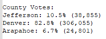
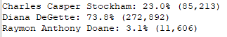

# **Election_Analysis**
---

## **Overview**
---
 
Tom and Seth enlisted my help with analyzing election results from multiple counties using Python. They needed to know the total number of votes collected, breakdown of how many votes per county and for which candidates, county with the largest voter turnout, and the percentage of votes each candidate received. Finally I was able to utilize Python syntax in VS Code to format the data into displaying the winning candidate, number of votes they received, and percentage of votes that they earned.
  

## **Election-Audit Results**
---
- ### **How many votes were cast in this congressional election?**

This election had 369,711 total votes. To acquire that number, I first initialized a variable `total_votes` to zero. Following that step, I opened the election data file to begin my analysis using the `with open` function. Created a `for` loop that looped through the rows extracting desired data values. Line of code that tallied up the total votes was: `total_votes = total_votes + 1`. This line added 1 to the total number of votes each time the `for` loop looped through another row in the supplied dataset.

- ### **Provide a breakdown of the number of votes and percentage of total votes for each county in the precinct.**
Now that I had the total number of votes, it was time to figure out how many votes each county received and calculate the percentage. To do this I created a list of the counties (`county_list`) and dictionary of county votes (`county_votes`) in Python. To get the input for each of these, I created a conditional statement within the `for` loop mentioned above.   
`if county_name not in county_list:` 
>`county_list.append(county_name)` 
>`county_votes[county_name] = 0` 

`county_votes[county_name] += 1`  
That gave me the total votes for each county, but I still had to calculate the percentages. This was accomplished with another `for` loop.   
`for county_name in county_votes` 
>`current_county_votes = county_votes[county_name]` 
>`county_percentage = float(current_county_votes) / float(total_votes) * 100` 

 Upon using command `txt_file.write(county_results)` when running my code, the output was sent to my txt file "election_analysis". This output can be seen in the image below.  
 
*Figure 1: Snip of output from election_analysis text file.*  

- ### **Which county had the largest number of votes?**   

Denver county received the largest number of votes.   

- ### **Provide a breakdown of the number of votes and the percentage of the total votes each candidate received.**
Similar to the process above with finding the number of county votes, I isolated the number of votes for each candidate using Python code. First, I had to create a list named `candidate_options`, and a dictionary named `candidate_votes`. These variables were used in an `if` statement (conditional statement) that extracted each unique candidate name from the rows of data as my `for` loop was running. Once extracted, they were added in to each list or dictionary based on the conditions I set. See below.   

`if candidate_name not in candidate_options:` 
> `candidate_options.append(candidate_name)` 
> `candidate_votes[candidate_name] += 1` 

 When these variables held the data I needed, I created a second `for` loop farther down in the code to calculate number of votes for each candidate and their percentages.  

`for candidate_name in candidate_votes:`  
> `votes = candidate_votes.get(candidate_name)`  
> `vote_percentage = float(votes) / float(total_votes) * 100`  
> `candidate_results = (f"{candidate_name}: {vote_percentage:.1f}% ({votes:,})\n")`  

 I'm going to break down the Python syntax in the code above. The first line states the beginning of the `for` loop. As it's running, `votes` collects the number of votes per candidate name. The next line down shows `vote_percentage` which calculates the percent of total votes for each candidate. Finally, the last line `candidate_results` prints my output. I used and f string to convert all of the outputted data to the same data type. When utilizing an f string, all variables must be placed inside curly brackets. The information outside of the curly brackets is string data that I would like printed, and typed in myself. At the end of `vote_percentage` I told Python that I would like the percentage to be formatted to the tenths place. Also by entering `:,` after `votes` in my f string statement, I formatted the number to print with a thousands divider. See image of my text file below.   

 
*Figure 2: Candidate output in election_analysis.txt.*   

- ### **Which candidate won the election, what was their vote count, and what was their percentage of the total votes?** 

Diana DeGette won the election with 272,892 votes, which was 73.8% of total votes collected.

## **Election-Audit Summary**
---
Tom and Seth were delighted with my findings. I'm pleased to announce that the code written for this election can be modified to suit any election results in files like the one I was given.  At the very beginning, the code must be given a file to extract data from. To do this I chose to link it with an indirect path, so any user would be able to locate the file and run the code. See below.   
`file_to_load = os.path.join("Resources","election_results.csv")`  
`Resources` refers to the folder that the file is stored inside. As long as the location of the desired data file is known, it can be entered here.  
This code allows for the user to make a few adjustments and run the results on any election. Say we wanted to know election results for the a state rather than a county.   
` state_list = []` 
` state_votes = {}` 
` largest_state = ""`  
` state_voter_turnout = 0 `   
Now it becomes as simple as updating the information into the code as you would do with a template. 